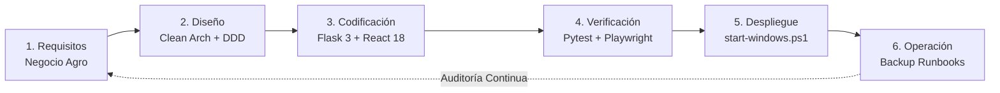
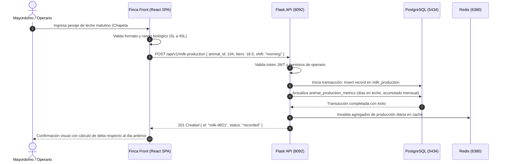
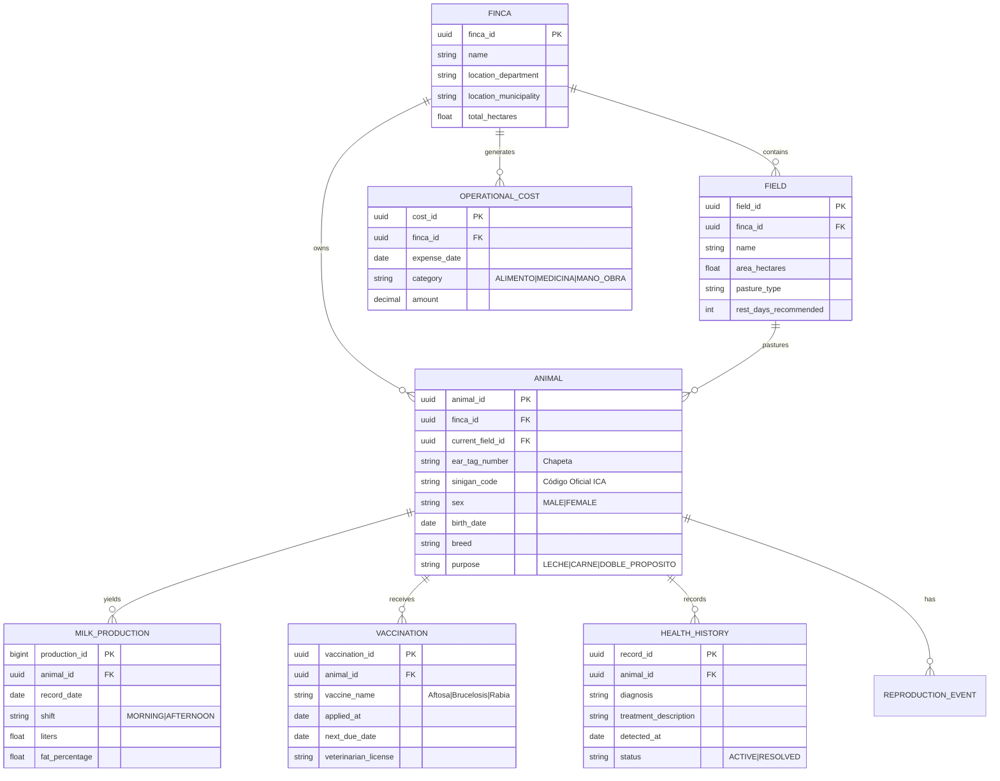

# 🌾 VillaLuz — Plataforma Integral de Gestión Ganadera y Agropecuaria Digital

[](https://python.org)
[](https://flask.palletsprojects.com/)
[](https://react.dev/)
[](https://typescriptlang.org/)
[](https://vitejs.dev/)
[-336791?style=for-the-badge&logo=postgresql&logoColor=white)](https://postgresql.org)
[](https://redis.io)
[](https://www.ica.gov.co)
[](tests/)

> Plataforma tecnológica de misión crítica diseñada para la digitalización, trazabilidad bovina, registro sanitario nacional (SINIGAN/ICA), control lechero, optimización reproductiva y balance financiero operativo de la **Finca Villa Luz**.

---

## 📋 Tabla de Contenido
- [Visión del Negocio y Propósito](#-visión-del-negocio-y-propósito)
- [Capacidades del Sistema](#-capacidades-del-sistema)
- [Ciclo de Desarrollo del Software (SDLC)](#-ciclo-de-desarrollo-del-software-sdlc)
  - [Fase 1: Descubrimiento del Negocio y Requisitos de Dominio](#fase-1-descubrimiento-del-negocio-y-requisitos-de-dominio)
  - [Fase 2: Arquitectura del Sistema y Diseño de Software](#fase-2-arquitectura-del-sistema-y-diseño-de-software)
  - [Fase 3: Implementación y Estándares de Código](#fase-3-implementación-y-estándares-de-código)
  - [Fase 4: Aseguramiento de Calidad, Testing y Verificación](#fase-4-aseguramiento-de-calidad-testing-y-verificación)
  - [Fase 5: Runtime, Despliegue y Operación en Producción](#fase-5-runtime-despliegue-y-operación-en-producción)
  - [Fase 6: Respaldo, Continuidad del Negocio y Mantenimiento](#fase-6-respaldo-continuidad-del-negocio-y-mantenimiento)
- [Diagramas del Proyecto](#-diagramas-del-proyecto)
  - [Diagrama de Arquitectura Tecnológica](#diagrama-de-arquitectura-tecnológica)
  - [Diagrama de Secuencia: Trazabilidad y Producción Lechera Diaria](#diagrama-de-secuencia-trazabilidad-y-producción-lechera-diaria)
  - [Diagrama Entidad-Relación (ERD del Dominio Ganadero)](#diagrama-entidad-relación-erd-del-dominio-ganadero)
- [Estructura del Proyecto (Monorepo)](#-estructura-del-proyecto-monorepo)
- [Guía de Puesta en Marcha Rápida (Windows Nativo)](#-guía-de-puesta-en-marcha-rápida-windows-nativo)
- [Estrategia de Pruebas](#-estrategia-de-pruebas)
- [Políticas de Respaldo y Recuperación](#-políticas-de-respaldo-y-recuperación)
- [Licencia y Créditos](#-licencia-y-créditos)

---

## 🎯 Visión del Negocio y Propósito

La ganadería moderna y la gestión agropecuaria en Colombia exigen superar el uso de planillas manuales y la dispersión de información. **VillaLuz** consolida un ecosistema unificado para:
1. **Trazabilidad Bovina Total**: Historial genealógico, pesajes, traslados entre potreros y homologación con el Sistema Nacional de Identificación e Información de Ganado Bovino (**SINIGAN / ICA**).
2. **Control Lechero de Alta Precisión**: Registro de pesaje por ordeño (mañana/tarde), análisis de curvas de lactancia y cálculo de rendimientos por animal/lote.
3. **Salud y Bioseguridad Animal**: Protocolos de vacunación obligatoria (Fiebre Aftosa, Brucelosis), planes de desparasitación, cuarentenas y tratamientos veterinarios.
4. **Viabilidad Financiera en Tiempo Real**: Costos operativos directos (insumos, concentrados, mano de obra, medicamentos) contrastados contra ventas de leche y animales.

---

## 🌟 Capacidades del Sistema

- 🐄 **Ficha Bovina Digital**: Identificación visual (chapeta) y electrónica (RFID/microchip), raza, fenotipo y condición corporal (BCS).
- 🥛 **Módulo de Producción Láctea**: Registro individual y grupal, promedios móviles, días en leche (DEL) e intervalo entre partos (IEP).
- 🧬 **Mejoramiento Genético y Reproducción**: Inseminación artificial, montas naturales, chequeos de preñez (palpación/ecografía) y alertas de celo.
- 🌾 **Rotación de Praderas y Forrajes**: Aforo de potreros, cálculo de capacidad de carga (UGM/ha) y tiempos de descanso del pasto.
- 🛒 **Marketplace Agropecuario y Campesino**: Vitrina comercial para comercialización justa de derivados lácteos y pie de cría.
- 📱 **Experiencia Web Progresiva Adaptable**: Interfaz de usuario diseñada para trabajo en campo con navegación táctil fluida y soporte de sincronización.

---

## 🔄 Ciclo de Desarrollo del Software (SDLC)

El ciclo de desarrollo en VillaLuz combina agilidad con estrictos lineamientos de calidad DevBrain:



### Fase 1: Descubrimiento del Negocio y Requisitos de Dominio
- **Levantamiento con Product Owners**: Análisis de operaciones diarias en ordeño, estabulado y pastoreo.
- **Cumplimiento Normativo Colombiano**: Integración del estándar de identificación oficial ICA/SINIGAN.
- **Requisitos No Funcionales (NFR)**:
  - Cero pérdida de datos ante interrupciones de energía o conectividad en zona rural.
  - Tiempo de respuesta API inferior a 120ms en endpoints transaccionales.
  - Autenticación segura mediante JWT con expiración controlada y RBAC (Administrador, Veterinario, Mayordomo, Operario).

### Fase 2: Arquitectura del Sistema y Diseño de Software
- **Monorepo Limpio**: Separación estricta en dos raíces: `backend/` (Flask API RESTful) y `frontend/` (React/Vite SPA).
- **Domain-Driven Design (DDD)**: Entidades y agregados desacoplados de detalles de persistencia.
- **Patrón de Manejo de Errores RFC 7807**: Respuestas de fallo predecibles con código URI, título, status y detalles legibles.
- **Caché en Memoria**: Memurai/Redis para acelerar catálogos maestros y agregados estadísticos.

### Fase 3: Implementación y Estándares de Código
- **Backend**: Python 3.11+, SQLAlchemy 2.0 con migraciones declarativas Alembic y Pydantic/Marshmallow para serialización.
- **Frontend**: React 18 con TypeScript en modo estricto, Radix UI para accesibilidad nativa y Tailwind CSS para diseño responsivo.
- **Control de Puertos DevBrain**: Backend escuchando en `http://127.0.0.1:8092`, Frontend en `http://127.0.0.1:3005`.

### Fase 4: Aseguramiento de Calidad, Testing y Verificación
- **Backend Tests (Pytest)**:
  - Pruebas unitarias de modelos matemáticos (curvas de lactancia, aforos de pastura).
  - Pruebas de integración sobre transacciones SQLAlchemy con base de datos de test aislada.
- **Frontend Tests (Vitest & React Testing Library)**:
  - Pruebas de componentes, formularios reactivos y custom hooks.
- **End-to-End (Playwright)**:
  - Flujos completos de usuario: Registro de animal -> Asignación a potrero -> Ingreso de pesaje lechero -> Comprobación de balance.

### Fase 5: Runtime, Despliegue y Operación en Producción
- **Windows Nativo como Entorno Primario**: Gestión orquestada mediante `start-windows.ps1` con flags `-Daemon`, `-Status`, `-Stop`.
- **Base de Datos**: PostgreSQL 18 nativo en puerto `5434`, esquema `villaluz`.
- **Memurai/Redis**: Broker y caché local en puerto `6380`.

### Fase 6: Respaldo, Continuidad del Negocio y Mantenimiento
- **Estrategia Anti-Data Loss**: Scripts automáticos de backup de PostgreSQL fuera del repositorio (`Documentos/Backups/VillaLuz`).
- **Runbook Operativo**: [`docs/operations/BACKUP_RUNBOOK.md`](docs/operations/BACKUP_RUNBOOK.md) con procedimientos paso a paso de restauración ante desastres.

---

## 📊 Diagramas del Proyecto

### Diagrama de Arquitectura Tecnológica

```mermaid
graph TB
    subgraph ClientLayer ["Capa de Cliente (Navegador / Dispositivo Campo)"]
        Browser["🌐 React 18 + Vite SPA<br/>(Puerto 3005)<br/>Radix UI + Tailwind CSS"]
    end

    subgraph ApiGateway ["Capa de Servicio y API (Backend)"]
        FlaskServer["🐍 Flask 3.x REST Core<br/>(Puerto 8092)"]
        AuthFilter["🔐 JWT Authentication & RBAC"]
        ErrorFormatter["📜 RFC 7807 Problem Details"]
    end

    subgraph DomainModules ["Módulos de Negocio"]
        LivestockMod["🐄 Ganadería & Trazabilidad"]
        MilkMod["🥛 Producción Lechera"]
        HealthMod["💉 Salud & Vacunación"]
        FinanceMod["💰 Costos & Inventario"]
        SyncMod["🔄 Sincronización & Offline Cache"]
    end

    subgraph DataLayer ["Capa de Persistencia y Caché (Windows Nativo)"]
        Postgres["🐘 PostgreSQL 18 (Puerto 5434)<br/>Schema: villaluz"]
        RedisCache["⚡ Memurai / Redis (Puerto 6380)<br/>Caché y Tareas Asíncronas"]
        Storage["📁 File Storage (Documentos / Fotos)"]
    end

    Browser -->|HTTP / JSON (REST)| FlaskServer
    FlaskServer --> AuthFilter
    AuthFilter --> DomainModules
    DomainModules --> ErrorFormatter

    DomainModules -->|SQLAlchemy 2.0 ORM| Postgres
    DomainModules -->|Fast Retrieval / Sessions| RedisCache
    DomainModules -->|Evidencias Sanitarias| Storage
```

### Diagrama de Secuencia: Trazabilidad y Producción Lechera Diaria



### Diagrama Entidad-Relación (ERD del Dominio Ganadero)



---

## 📂 Estructura del Proyecto (Monorepo)

```text
villaluz/
├── backend/                  # API RESTful en Python/Flask y lógica de dominio
│   ├── app/
│   │   ├── api/              # Endpoints, routers y controladores REST
│   │   ├── brain/            # Servicios de reglas heurísticas y análisis
│   │   ├── models/           # Entidades SQLAlchemy (Ganado, Leche, Salud, Costos)
│   │   ├── services/         # Casos de uso de negocio y lógica transaccional
│   │   ├── tasks/            # Tareas asíncronas y cálculos en batch
│   │   └── utils/            # Funciones auxiliares de formateo y fechas
│   ├── config.py             # Configuración canónica de la aplicación backend
│   └── tests/                # Pruebas unitarias y de integración backend
├── frontend/                 # Aplicación cliente React 18 + Vite + TypeScript
│   ├── src/
│   │   ├── components/       # Componentes de UI accesibles (Radix UI)
│   │   ├── features/         # Vistas y lógica agrupada por dominio de negocio
│   │   ├── hooks/            # Custom React hooks para consultas y estado
│   │   └── types/            # Definiciones de tipos TypeScript compartidos
│   ├── package.json          # Dependencias y scripts de frontend
│   └── vite.config.ts        # Configuración de compilador y proxy Vite (3005)
├── docs/                     # Especificaciones técnicas, arquitectura y runbooks
│   └── operations/
│       └── BACKUP_RUNBOOK.md # Manual de respaldo y restauración de PostgreSQL
├── scripts/                  # Scripts de automatización y mantenimiento
├── tests/                    # Pruebas transversales y suite E2E (Playwright)
├── .devbrain/                # Contexto y lineamientos de arquitectura modular
├── PROJECT_GENOME.md         # Ficha canónica del sistema
├── start-windows.ps1         # Orquestador oficial de arranque Windows nativo
└── README.md                 # Este documento
```

---

## 🚀 Guía de Puesta en Marcha Rápida (Windows Nativo)

### Prerrequisitos
- **Windows 10 / 11** nativo (sin WSL ni contenedores locales en desarrollo).
- **Python 3.11+** y **Node.js 20+** instalados en PATH.
- **PostgreSQL 18** ejecutándose en el puerto `5434` (servicio `postgresql-x64-18`).
- **Memurai / Redis** ejecutándose en el puerto `6380`.

### 1. Iniciar el Entorno Completo con un Solo Comando
Abra una consola de PowerShell en la raíz del proyecto y ejecute:

```powershell
# Arranca Backend (8092) y Frontend (3005) en segundo plano
powershell -ExecutionPolicy Bypass -File .\start-windows.ps1 -Daemon
```

### 2. Verificar el Estado de los Servicios
```powershell
powershell -ExecutionPolicy Bypass -File .\start-windows.ps1 -Status
```
- **Backend API**: `http://127.0.0.1:8092`
- **Frontend Web**: `http://127.0.0.1:3005`
- **Health Check**: `http://127.0.0.1:8092/health`

### 3. Detener los Servicios
```powershell
powershell -ExecutionPolicy Bypass -File .\start-windows.ps1 -Stop
```

---

## 🧪 Estrategia de Pruebas

El monorepo cuenta con una suite completa de pruebas automatizadas:

```powershell
# 1. Pruebas de Backend (Python/Pytest)
pytest backend/tests/

# 2. Pruebas Unitarias de Frontend (Vitest)
npm --prefix frontend run test:run

# 3. Pruebas End-to-End en Navegador (Playwright)
npm --prefix frontend run test:e2e

# 4. Chequeo Estricto de Tipos TypeScript
npm --prefix frontend run type-check

# 5. Validación de Higiene de Código y Arquitectura
npm run hygiene
npm run modularity:changed
```

---

## 💾 Políticas de Respaldo y Recuperación

La información pecuaria es un activo crítico. Por diseño:
- Los respaldos automáticos se almacenan **fuera del repositorio de código**, por defecto en:
  `C:\Users\<Usuario>\Documents\Backups\VillaLuz`
- Para generar un respaldo manual inmediato de la base de datos:
  ```powershell
  powershell -ExecutionPolicy Bypass -File .\scripts\backup-database.ps1
  ```
- Para el procedimiento de contingencia ante pérdida de datos, consulte [`docs/operations/BACKUP_RUNBOOK.md`](docs/operations/BACKUP_RUNBOOK.md).

---

## 📄 Licencia y Créditos

Proyecto desarrollado bajo la titularidad de **Finca Villa Luz**. Todos los derechos reservados.
Desarrollado y mantenido bajo el estándar de ingeniería de software **DevBrain v8.10**.
