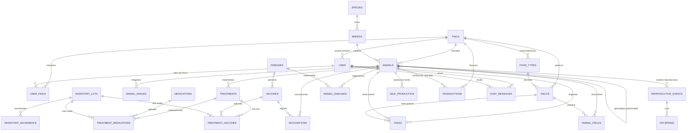

# Modelo de Datos y Relaciones - Finca Villa Luz

Auditoria actualizada: 2026-05-06. Fuente principal: modelos SQLAlchemy en `backend/app/models`, registro de namespaces de la API, y base local `backend/instance/finca.db`.

## Resumen Ejecutivo

- El runtime de la API conoce **44 tablas de modelo** despues de importar todos los modulos relevantes.
- `app.models.__init__` solo expone **36 tablas**, por lo que hay **8 tablas utiles no exportadas** en el paquete canonical de modelos.
- `backend/instance/finca.db` contiene **40 tablas de negocio** mas `alembic_version`.
- Faltan en `finca.db`: `animal_group_membership`, `animal_groups`, `infrastructure`, `pasture_aforos`.
- Sobran en `finca.db` frente al modelo runtime: ninguna.
- Hay drift de columnas en `animals`, `fields`, `treatments`, `breeds` y `species`; eso puede romper pantallas, migraciones y sincronizacion offline.
- `app.models.production_finance.MilkProduction` duplica la tabla `milk_production`; SQLAlchemy reporta `Table 'milk_production' is already defined`. Ese modulo tambien deja `FarmExpenses` sin registrarse al abortar la importacion.

## Lectura Correcta Del Modelo

Hay dos niveles:

- **Modelo canonical exportado:** lo que importa `app.models.__init__`; util para pruebas y servicios que usan `from app.models import ...`.
- **Modelo runtime completo:** lo que aparece al importar namespaces como `farm.operational_namespace`, `farm.animal_groups_namespace`, `farm.infrastructure_namespace` y servicios de analytics.

Para que migraciones, pruebas y autogeneracion funcionen sin sorpresas, el proyecto deberia consolidar ambos niveles: todo modelo vivo debe estar exportado desde `app.models.__init__` o documentado como experimental/deprecated.

## Tablas No Exportadas Por `app.models.__init__`

`animal_group_membership`, `animal_groups`, `financial_summary`, `infrastructure`, `livestock_summary`, `milk_summary`, `operational_costs`, `pasture_aforos`.

Estas tablas existen en modulos de modelo o se usan desde namespaces, pero no estan en el indice canonical. El mayor riesgo es que migraciones, seeders, pruebas o imports parciales no las vean.

## Drift Modelo vs `finca.db`

| Tabla | Columnas en modelo pero no en `finca.db` | Columnas en `finca.db` pero no en modelo |
|---|---|---|
| `animals` | `idFatherFather`, `idFatherMother`, `idMotherFather`, `idMotherMother`, `is_lactating`, `is_pregnant`, `last_calving_date` | - |
| `breeds` | - | `characteristics`, `description` |
| `fields` | `grazing_days`, `last_grazing_date`, `rest_days` | - |
| `species` | - | `description` |
| `treatments` | `withdrawal_days`, `withdrawal_end_date` | - |

Accion recomendada: decidir si cada diferencia es cambio pendiente o columna legacy. Luego crear una migracion Alembic unica que deje `finca.db`, `test_finca.db`, MariaDB y modelos en el mismo contrato.

## Inventario De Tablas

| Tabla | Dominio | Clase(s) | PK | `finca_id` | BaseModel | Existe en `finca.db` | Exportada en `app.models` | FK principales |
|---|---|---|---|---|---|---|---|---|
| `activity_daily_agg` | Comunicacion / auditoria | `ActivityDailyAgg` | `id` | si | si | si | si | finca_id -> finca.id |
| `activity_log` | Comunicacion / auditoria | `ActivityLog` | `id` | si | si | si | si | actor_id -> user.id finca_id -> finca.id |
| `chat_messages` | Comunicacion / auditoria | `ChatMessage` | `id` | si | no | si | si | finca_id -> finca.id sender_id -> user.id recipient_id -> user.id |
| `financial_summary` | Finanzas | `FinancialSummary` | `id` | si | si | si | no | finca_id -> finca.id |
| `operational_costs` | Finanzas | `OperationalCost` | `id` | si | si | si | no | finca_id -> finca.id |
| `transactions` | Finanzas | `Transaction` | `id` | si | si | si | si | finca_id -> finca.id animal_id -> animals.id |
| `fields` | Finca / operaciones | `Fields` | `id` | si | si | si | si | food_type_id -> food_types.id finca_id -> finca.id |
| `food_types` | Finca / operaciones | `FoodTypes` | `id` | si | si | si | si | finca_id -> finca.id |
| `infrastructure` | Finca / operaciones | `Infrastructure` | `id` | si | si | no | no | finca_id -> finca.id |
| `pasture_aforos` | Finca / operaciones | `PastureAforo` | `id` | si | si | no | no | field_id -> fields.id finca_id -> finca.id |
| `route_administrations` | Finca / operaciones | `RouteAdministration` | `id` | no | si | si | si | - |
| `tasks` | Finca / operaciones | `Tasks` | `id` | si | si | si | si | animal_id -> animals.id field_id -> fields.id assigned_to -> user.id finca_id -> finca.id |
| `animal_diseases` | Gestion animal | `AnimalDiseases` | `id` | si | si | si | si | animal_id -> animals.id disease_id -> diseases.id instructor_id -> user.id finca_id -> finca.id |
| `animal_fields` | Gestion animal | `AnimalFields` | `id` | si | si | si | si | animal_id -> animals.id field_id -> fields.id finca_id -> finca.id |
| `animal_group_membership` | Gestion animal | `AnimalGroupMembership` | `animal_id, group_id` | no | no | no | no | animal_id -> animals.id group_id -> animal_groups.id |
| `animal_groups` | Gestion animal | `AnimalGroup` | `id` | si | si | no | no | finca_id -> finca.id |
| `animal_images` | Gestion animal | `AnimalImages` | `id` | si | si | si | si | animal_id -> animals.id finca_id -> finca.id |
| `animals` | Gestion animal | `Animals` | `id` | si | si | si | si | finca_id -> finca.id breeds_id -> breeds.id idFather -> animals.id idMother -> animals.id idFatherFather -> animals.id idFatherMother -> animals.id idMotherFather -> animals.id idMotherMother -> animals.id |
| `breeds` | Gestion animal | `Breeds` | `id` | no | si | si | si | species_id -> species.id |
| `species` | Gestion animal | `Species` | `id` | no | si | si | si | - |
| `finca` | Identidad / acceso | `Finca` | `id` | no | si | si | si | - |
| `membership_request` | Identidad / acceso | `MembershipRequest` | `id` | si | si | si | si | user_id -> user.id finca_id -> finca.id processed_by -> user.id |
| `push_subscription` | Identidad / acceso | `PushSubscription` | `id` | no | no | si | si | user_id -> user.id |
| `user` | Identidad / acceso | `User` | `id` | si | si | si | si | finca_id -> finca.id |
| `user_finca` | Identidad / acceso | `UserFinca` | `id` | si | no | si | si | user_id -> user.id finca_id -> finca.id |
| `user_locations` | Identidad / acceso | `UserLocation` | `id` | si | no | si | si | user_id -> user.id finca_id -> finca.id |
| `genetic_improvements` | Produccion / reproduccion | `GeneticImprovements` | `id` | si | si | si | si | animal_id -> animals.id finca_id -> finca.id |
| `livestock_summary` | Produccion / reproduccion | `LivestockSummary` | `id` | si | si | si | no | finca_id -> finca.id |
| `milk_production` | Produccion / reproduccion | `MilkProduction` | `id` | si | si | si | si | animal_id -> animals.id finca_id -> finca.id |
| `milk_summary` | Produccion / reproduccion | `MilkSummary` | `id` | si | si | si | no | finca_id -> finca.id |
| `offspring` | Produccion / reproduccion | `Offspring` | `id` | no | si | si | si | birth_event_id -> reproductive_events.id animal_id -> animals.id |
| `reproductive_events` | Produccion / reproduccion | `ReproductiveEvent` | `id` | si | si | si | si | animal_id -> animals.id sire_id -> animals.id actor_id -> user.id finca_id -> finca.id |
| `animal_alert_configs` | Salud / inventario | `AnimalAlertConfig` | `id` | si | si | si | si | animal_id -> animals.id finca_id -> finca.id |
| `animal_alerts` | Salud / inventario | `AnimalAlert` | `id` | si | si | si | si | animal_id -> animals.id field_id -> fields.id config_id -> animal_alert_configs.id finca_id -> finca.id |
| `control` | Salud / inventario | `Control` | `id` | si | si | si | si | animal_id -> animals.id finca_id -> finca.id |
| `diseases` | Salud / inventario | `Diseases` | `id` | no | si | si | si | - |
| `inventory_lots` | Salud / inventario | `InventoryLot` | `id` | si | si | si | si | medication_id -> medications.id vaccine_id -> vaccines.id finca_id -> finca.id |
| `inventory_movements` | Salud / inventario | `InventoryMovement` | `id` | si | si | si | si | lot_id -> inventory_lots.id actor_id -> user.id finca_id -> finca.id |
| `medications` | Salud / inventario | `Medications` | `id` | no | si | si | si | route_administration_id -> route_administrations.id |
| `treatment_medications` | Salud / inventario | `TreatmentMedications` | `id` | no | si | si | si | treatment_id -> treatments.id medication_id -> medications.id lot_id -> inventory_lots.id |
| `treatment_vaccines` | Salud / inventario | `TreatmentVaccines` | `id` | no | si | si | si | treatment_id -> treatments.id vaccine_id -> vaccines.id lot_id -> inventory_lots.id |
| `treatments` | Salud / inventario | `Treatments` | `id` | si | si | si | si | animal_id -> animals.id finca_id -> finca.id |
| `vaccinations` | Salud / inventario | `Vaccinations` | `id` | si | si | si | si | animal_id -> animals.id vaccine_id -> vaccines.id apprentice_id -> user.id instructor_id -> user.id finca_id -> finca.id |
| `vaccines` | Salud / inventario | `Vaccines` | `id` | no | si | si | si | route_administration_id -> route_administrations.id target_disease_id -> diseases.id |

## Relaciones Declaradas En SQLAlchemy

| Tabla | Relaciones ORM |
|---|---|
| `activity_log` | actor -> User (MANYTOONE) |
| `animal_alert_configs` | animal -> Animals (MANYTOONE) triggered_alerts -> AnimalAlert (ONETOMANY) |
| `animal_alerts` | animal -> Animals (MANYTOONE) field -> Fields (MANYTOONE) config -> AnimalAlertConfig (MANYTOONE) |
| `animal_diseases` | animal -> Animals (MANYTOONE) disease -> Diseases (MANYTOONE) instructor -> User (MANYTOONE) |
| `animal_fields` | animal -> Animals (MANYTOONE) field -> Fields (MANYTOONE) |
| `animal_groups` | animals -> Animals (MANYTOMANY) |
| `animal_images` | animal -> Animals (MANYTOONE) |
| `animals` | finca -> Finca (MANYTOONE) breed -> Breeds (MANYTOONE) father -> Animals (MANYTOONE) mother -> Animals (MANYTOONE) treatments -> Treatments (ONETOMANY) vaccinations -> Vaccinations (ONETOMANY) diseases -> AnimalDiseases (ONETOMANY) controls -> Control (ONETOMANY) genetic_improvements -> GeneticImprovements (ONETOMANY) animal_fields -> AnimalFields (ONETOMANY) images -> AnimalImages (ONETOMANY) alerts -> AnimalAlert (ONETOMANY) alert_configs -> AnimalAlertConfig (ONETOMANY) tasks -> Tasks (ONETOMANY) groups -> AnimalGroup (MANYTOMANY) |
| `breeds` | animals -> Animals (ONETOMANY) species -> Species (MANYTOONE) |
| `chat_messages` | sender -> User (MANYTOONE) recipient -> User (MANYTOONE) |
| `control` | animals -> Animals (MANYTOONE) |
| `diseases` | animals -> AnimalDiseases (ONETOMANY) vaccines -> Vaccines (ONETOMANY) |
| `fields` | animal_fields -> AnimalFields (ONETOMANY) food_types -> FoodTypes (MANYTOONE) alerts -> AnimalAlert (ONETOMANY) tasks -> Tasks (ONETOMANY) |
| `finca` | users -> User (ONETOMANY) animals -> Animals (ONETOMANY) user_memberships -> UserFinca (ONETOMANY) membership_requests -> MembershipRequest (ONETOMANY) |
| `food_types` | fields -> Fields (ONETOMANY) |
| `genetic_improvements` | animals -> Animals (MANYTOONE) |
| `inventory_lots` | medication -> Medications (MANYTOONE) vaccine -> Vaccines (MANYTOONE) movements -> InventoryMovement (ONETOMANY) medication_treatments -> TreatmentMedications (ONETOMANY) vaccine_treatments -> TreatmentVaccines (ONETOMANY) |
| `inventory_movements` | lot -> InventoryLot (MANYTOONE) actor -> User (MANYTOONE) |
| `medications` | treatments -> TreatmentMedications (ONETOMANY) route_administration_rel -> RouteAdministration (MANYTOONE) |
| `membership_request` | user -> User (MANYTOONE) finca -> Finca (MANYTOONE) processor -> User (MANYTOONE) |
| `offspring` | birth_event -> ReproductiveEvent (MANYTOONE) animal -> Animals (MANYTOONE) |
| `push_subscription` | user -> User (MANYTOONE) |
| `reproductive_events` | animal -> Animals (MANYTOONE) sire -> Animals (MANYTOONE) actor -> User (MANYTOONE) offspring -> Offspring (ONETOMANY) |
| `route_administrations` | medications -> Medications (ONETOMANY) vaccines -> Vaccines (ONETOMANY) |
| `species` | breeds -> Breeds (ONETOMANY) |
| `tasks` | animal -> Animals (MANYTOONE) field -> Fields (MANYTOONE) assignee -> User (MANYTOONE) |
| `transactions` | animal -> Animals (MANYTOONE) |
| `treatment_medications` | treatments -> Treatments (MANYTOONE) medications -> Medications (MANYTOONE) lot -> InventoryLot (MANYTOONE) |
| `treatment_vaccines` | treatments -> Treatments (MANYTOONE) vaccines -> Vaccines (MANYTOONE) lot -> InventoryLot (MANYTOONE) |
| `treatments` | animals -> Animals (MANYTOONE) vaccines_treatments -> TreatmentVaccines (ONETOMANY) medication_treatments -> TreatmentMedications (ONETOMANY) |
| `user` | finca -> Finca (MANYTOONE) diseases -> AnimalDiseases (ONETOMANY) vaccines_as_apprentice -> Vaccinations (ONETOMANY) vaccines_as_instructor -> Vaccinations (ONETOMANY) finca_memberships -> UserFinca (ONETOMANY) push_subscriptions -> PushSubscription (ONETOMANY) membership_requests -> MembershipRequest (ONETOMANY) processed_requests -> MembershipRequest (ONETOMANY) sent_messages -> ChatMessage (ONETOMANY) received_messages -> ChatMessage (ONETOMANY) assigned_tasks -> Tasks (ONETOMANY) |
| `user_finca` | user -> User (MANYTOONE) finca -> Finca (MANYTOONE) |
| `vaccinations` | animals -> Animals (MANYTOONE) vaccines -> Vaccines (MANYTOONE) apprentice -> User (MANYTOONE) instructor -> User (MANYTOONE) |
| `vaccines` | diseases -> Diseases (MANYTOONE) treatments -> TreatmentVaccines (ONETOMANY) vaccinations -> Vaccinations (ONETOMANY) route_administration_rel -> RouteAdministration (MANYTOONE) |

## ERD De Dominio Principal

## Reglas De Integridad Que Ya Existen

- Multi-tenant por `finca_id` en la mayoria de tablas operativas.
- `BaseModel` agrega `created_at`, `updated_at`, `version_id`, `is_deleted`, `deleted_at`, `created_by` y `updated_by`.
- `version_id` permite concurrencia optimista, pero todavia no equivale a sincronizacion distribuida entre dispositivos.
- Las tablas de resumen (`livestock_summary`, `financial_summary`, `milk_summary`) aceleran dashboard, pero deben recalcularse y validarse despues de operaciones offline o mesh.

## Riesgos Prioritarios

1. **Migraciones incompletas:** `finca.db` no tiene `animal_groups`, `animal_group_membership`, `pasture_aforos` ni `infrastructure`, aunque los namespaces existen.
2. **Contrato inconsistente:** `breeds.description`, `breeds.characteristics` y `species.description` existen en DB pero no en modelo; en sentido contrario faltan campos reproductivos/genealogicos y de potrero en DB.
3. **Modelo duplicado:** `production_finance.py` redefine `MilkProduction`; debe eliminarse, renombrarse o usar una tabla distinta.
4. **Indice canonical incompleto:** agregar exportaciones faltantes a `app.models.__init__` cuando se estabilicen.
5. **Offline conflictivo:** `version_id` es base, pero falta `sync_oplog`, identidad de dispositivo, tombstones distribuidos y resolucion de conflictos por campo.

## Acciones Recomendadas

1. Crear migracion Alembic para alinear `finca.db` con el runtime de 44 tablas o retirar namespaces experimentales.
2. Corregir `production_finance.py`: no puede declarar otra clase `MilkProduction` sobre `milk_production`.
3. Exportar en `app.models.__init__` los modelos vivos: summaries, operational costs, animal groups, pasture aforos e infrastructure.
4. Agregar pruebas de arranque que importen todos los modelos y fallen si hay tablas duplicadas o clases no mapeadas.
5. Antes de expandir mesh/offline, introducir tablas de sincronizacion: `devices`, `sync_operations`, `sync_sessions`, `sync_conflicts`, `node_messages`, `attachment_blobs`.
